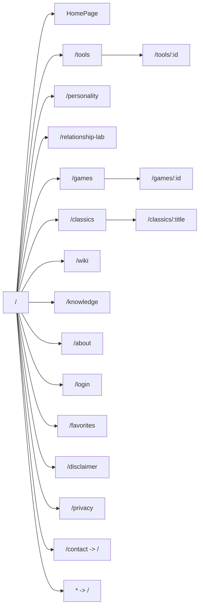
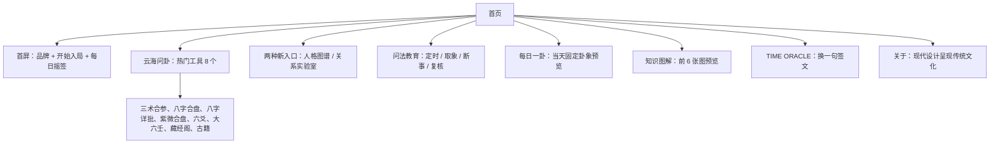
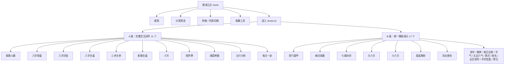
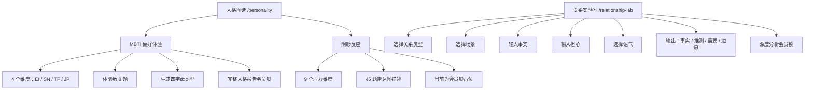
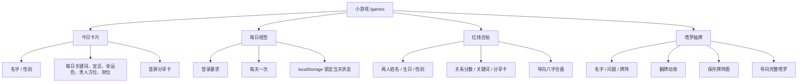
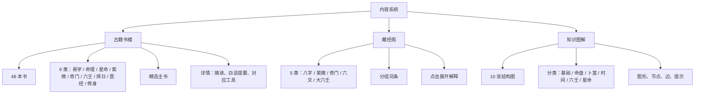
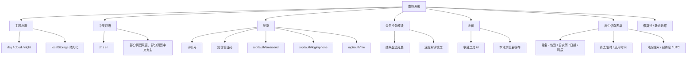
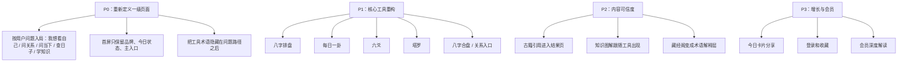
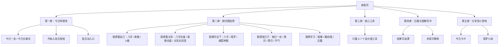

# MMEETT Fate 功能图

生成时间：2026-08-03  
项目位置：`/Users/leon/Downloads/fate-web`  
当前性质：Vite + React 复刻项目，已实现多页面命理工具门户，部分功能为演示假数据。

## 1. 产品定位

MMEETT Fate 当前不是单一展示页，而是一个“东方命理推演云台”：

- 用首页完成品牌进入、热门入口和教育引导。
- 用推演云台承载 28 个工具入口。
- 用人格图谱、关系实验室承载两个偏现代心理/关系产品。
- 用小游戏承载可分享、轻互动的增长入口。
- 用古籍、藏经阁、知识图解承载内容可信度和术语学习。
- 用登录、收藏、会员解读做基础商业闭环。

## 2. 总功能结构图

```mermaid
flowchart TB
  A["MMEETT Fate"] --> H["首页 /"]
  A --> T["推演云台 /tools"]
  A --> P["人格图谱 /personality"]
  A --> R["关系实验室 /relationship-lab"]
  A --> G["小游戏 /games"]
  A --> C["古籍书楼 /classics"]
  A --> W["藏经阁 /wiki"]
  A --> K["知识图解 /knowledge"]
  A --> F["我的收藏 /favorites"]
  A --> S["支撑系统"]

  H --> H1["Hero 品牌进入"]
  H --> H2["热门工具入口"]
  H --> H3["人格 / 关系双入口"]
  H --> H4["每日一卦预览"]
  H --> H5["知识图解预览"]
  H --> H6["换一句签文"]
  H --> H7["关于与免责声明导向"]

  T --> T1["命盘类"]
  T --> T2["卜筮类"]
  T --> T3["分析类"]
  T --> T4["实用小工具"]

  G --> G1["今日卡片"]
  G --> G2["每日摇签"]
  G --> G3["红线合拍"]
  G --> G4["塔罗抽牌"]

  C --> C1["48 本古籍"]
  C --> C2["9 个古籍分类"]
  C --> C3["古籍详情页"]

  W --> W1["术语词条"]
  W --> W2["5 个词条分类"]
  W --> W3["分组展开阅读"]

  K --> K1["10 张结构图"]
  K --> K2["概念节点"]
  K --> K3["关系边说明"]

  S --> S1["主题皮肤：昼 / 云海 / 夜"]
  S --> S2["中英切换"]
  S --> S3["手机号短信登录"]
  S --> S4["会员全能解读锁"]
  S --> S5["localStorage 收藏"]
  S --> S6["本地假算法 / 假数据"]
```

## 3. 路由功能图

## 4. 一级导航

当前顶部导航来自 `src/data/nav.ts`：

| 导航 | 路径 | 当前作用 |
|---|---|---|
| 首页 | `/` | 品牌首屏、热门入口、每日一卦、知识预览 |
| 推演 | `/tools` | 所有推演工具的筛选、搜索、收藏、进入 |
| 人格 | `/personality` | MBTI 体验版 + 阴影反应会员占位 |
| 关系 | `/relationship-lab` | 关系场景整理、事实/推测/需要/边界输出 |
| 小游戏 | `/games` | 4 个轻互动入口 |
| 古籍 | `/classics` | 48 本古籍索引与详情 |
| 藏经阁 | `/wiki` | 术语百科词条 |
| 图解 | `/knowledge` | 概念结构图 |
| 收藏 | `/favorites` | 本地收藏工具 |

## 5. 当前首页模块图与重构方向

新的首页结构已单独记录在 `docs/homepage-function-map.md`。后续首页设计和实现以该文件为准；本节保留当前复刻项目首页的功能库存，用于对照迁移。

首页适合重构为“一级入口页”，但当前内容偏长，包含产品说明、工具入口、知识预览和品牌宣言。已确认的新首页顺序为：

1. 第一屏：今日命理场。
2. 意图推荐区。
3. 回访与每日使用。
4. 结果可信度展示。
5. 更多探索。
6. 页脚。

## 6. 推演工具功能图

当前工具总数：28 个。数据来自 `src/data/tools.ts`。

### 工具分类

| 分类 | 数量 | 工具 |
|---|---:|---|
| 命盘 | 9 | 紫微斗数、八字排盘、八字详批、八字合盘、奇门遁甲、梅花易数、三术合参、七政四余、紫微合盘 |
| 卜筮 | 6 | 大六壬、小六壬、六爻、塔罗牌、诸葛神数、星盘解析 |
| 分析 | 2 | 风水勘宅、五行分析 |
| 实用小工具 | 11 | 测字、周公解梦、每日运势、每日一卦、节气时令、五运六气、黄历、姓名分析、出生校时、寻时定盘、择日速览 |

### A 级工具实际闭环

| 工具 | 当前输入 | 当前输出 | 重构价值 |
|---|---|---|---|
| 八字排盘 | 姓名、性别、日期、时辰、地点、时间口径 | 四柱、五行、大运/年度、会员解读 | 高 |
| 紫微斗数 | 出生信息 | 十二宫、主星、标签、会员解读 | 高 |
| 八字详批 | 出生信息 + 侧重问题 | 四柱 + 古籍摘句锚点 + 五行力量 | 高 |
| 八字合盘 | 两人出生信息 + 关系维度 | 契合分、吸引、互补、摩擦、双盘对照 | 高 |
| 紫微合盘 | 两人出生信息 + 关系维度 | 合缘评分和宫位参详 | 中高 |
| 三术合参 | 出生信息 + 问题 | 八字、紫微、奇门互证 | 高，但需要重新设计信息层级 |
| 六爻 | 所问之事 | 铜钱动画、本卦、变卦、断辞 | 高 |
| 塔罗牌 | 牌阵选择 | 抽牌、翻牌、正逆位、会员解读 | 高 |
| 诸葛神数 | 三字/问题 | 384 签演示结果 | 中 |
| 五行分析 | 出生信息 | 五行旺衰、建议、会员解读 | 中高 |
| 每日一卦 | 姓名、性别、日期 | 本卦、变卦、详情折叠、保存长图 | 高 |

### B 级工具现状

B 级工具统一走 `ToolScaffold`：根据工具准备项生成表单，点击后给出一个模板化“盘面/结论”，会员区再锁深度解读。它们更像“入口占位”，不是完整算法工具。

重构时建议把 B 级分成两类：

- 保留为二期：大六壬、奇门遁甲、七政四余、星盘解析、风水勘宅、五运六气、寻时定盘。
- 可降级为内容入口：测字、解梦、黄历、节气、每日运势、姓名分析、出生校时、择日。

## 7. 人格与关系功能图

重构判断：

- 人格和关系是独立产品入口，不应混进传统命理工具列表。
- 当前人格测试太薄，适合保留“方向”，重新设计为完整流程。
- 关系实验室的“事实-推测-需要-边界”结构清晰，适合作为重构时的核心交互模型。

## 8. 小游戏功能图

小游戏是增长入口，不是核心可信度入口。重构时建议保留“今日卡片”和“塔罗抽牌”作为视觉传播入口；每日摇签、红线合拍可根据目标人群决定是否弱化。

## 9. 内容系统功能图

内容系统是这个复刻项目里最适合重构为“可信度层”的部分。建议不要把它当资料库堆在后面，而是和工具结果互相引用：

- 八字结果页引用八字判断顺序、五行生克环、相关古籍。
- 六爻结果页引用起卦到断卦、六亲六神。
- 三术合参结果页引用三术合参路径。
- 每日一卦引用知识图解和古籍摘句。

## 10. 支撑系统图

## 11. 当前功能成熟度

| 层级 | 成熟度 | 说明 |
|---|---|---|
| 信息架构 | 中高 | 导航完整，但功能过多，首页叙事可压缩 |
| 视觉呈现 | 中 | 有统一东方云海风格，但多处卡片化、说明性偏强 |
| 核心工具 | 中 | A 级工具有交互闭环，但多数算法为演示假数据 |
| 内容系统 | 中高 | 古籍、词条、图解的数据结构清晰 |
| 商业闭环 | 低中 | 有登录、会员锁、收藏，但无真实会员/支付/档案体系 |
| 技术交付 | 中 | React/Vite 结构清楚，但直接 HTML 打包不适合离线打开 |

## 12. 重构优先级建议

## 13. 建议的新网页骨架

如果你要根据功能重新构造网页，可以用这个骨架取代当前“很多入口平铺”的方式：

## 14. 接手时需要注意的边界

- 当前所有排盘、签文、牌意、关系评分基本都是前端本地演示逻辑，不能当真实专业算法。
- 登录 API 需要后端 `/api/auth/*`，本地 Vite 配置代理到 `127.0.0.1:8080`；如果没有后端，登录会失败。
- 收藏、主题、语言、每日摇签状态主要走 `localStorage`。
- `dist/index.html` 当前不适合直接双击打开，因为资源路径是绝对路径。
- 重构时优先保留数据结构和路由关系，不要直接沿用所有现有页面布局。
