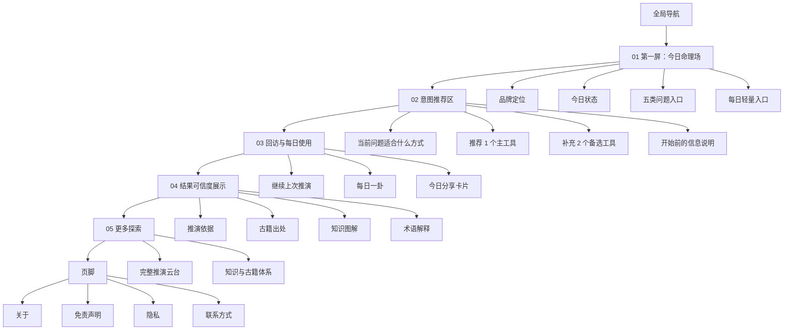
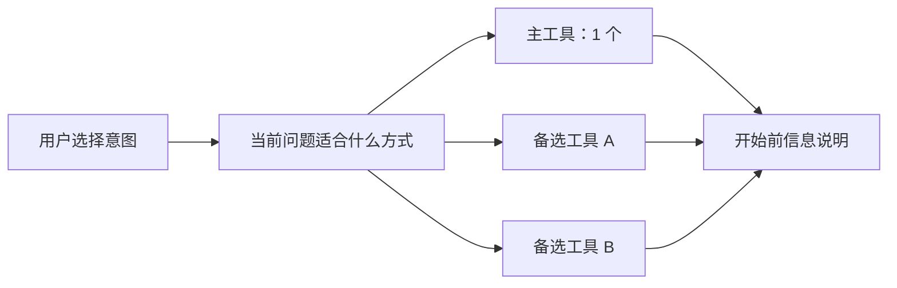

# MMEETT Fate 首页功能图

生成时间：2026-08-04  
项目位置：`/Users/leon/Downloads/fate-web`  
性质：第一阶段首页信息架构与功能分区准则。此文件以用户确认的首页方向为准，用于后续设计稿和实现，不代表当前 `src/pages/HomePage.tsx` 已完成对应改造。

## 1. 首页定位

首页不是 28 个工具的平均展示页，而是 MMEETT Fate 的一级入口场。

它的任务是：

- 让用户第一屏理解产品身份、今日状态和可以问什么。
- 用五类问题入口替代术语堆叠。
- 在用户进入工具前，推荐更合适的方法。
- 支持回访用户快速继续、每日使用和分享。
- 用推演依据、古籍出处、知识图解和术语解释建立结果可信度。
- 把完整推演云台、知识与古籍体系放在更后的位置，作为深入探索入口。

## 2. 首页总结构图

## 3. 第一屏：今日命理场

第一屏负责完成品牌进入和第一次分流。它不应平铺全部工具，也不应把功能说明写成大段介绍。

### 功能组成

| 模块 | 作用 | 主要输出 |
|---|---|---|
| 品牌定位 | 说明 MMEETT Fate 是“现代命理推演入口” | 产品名、核心气质、主操作 |
| 今日状态 | 给用户一个“今天可以进入”的理由 | 日期、今日卦象/状态、轻提示 |
| 五类问题入口 | 用问题意图替代工具术语 | 看自己、看关系、问当下、查日子、学知识 |
| 每日轻量入口 | 给低成本回访动作 | 每日一卦、每日摇签或今日卡片 |

### 五类问题入口

| 入口 | 用户问题 | 推荐方向 |
|---|---|---|
| 看自己 | 我想了解自己的结构、状态或趋势 | 八字、紫微、五行、人格图谱 |
| 看关系 | 我想理解两个人的互动和边界 | 八字合盘、紫微合盘、关系实验室 |
| 问当下 | 我现在有一件事想判断 | 六爻、塔罗、诸葛神数、每日一卦 |
| 查日子 | 我想看今天、择日或时令 | 黄历、节气、择日、每日运势 |
| 学知识 | 我想理解术语、依据和原典 | 藏经阁、知识图解、古籍书楼 |

## 4. 意图推荐区

意图推荐区负责把用户的问题转成方法建议。它不是工具列表，而是决策辅助区。

### 推荐规则

- 每次推荐 1 个主工具，降低选择压力。
- 同时提供 2 个备选工具，覆盖相邻方法。
- 在开始前说明需要的信息，例如出生时间、地点、双方资料、当前问题或抽牌方式。
- 当现有工具只是演示逻辑时，必须保留边界说明，不能包装成生产级预测。

### 推荐结构

## 5. 回访与每日使用

这一段服务回访用户和轻量使用，不承担复杂推演。

| 模块 | 作用 | 当前实现边界 |
|---|---|---|
| 继续上次推演 | 帮用户回到最近一次使用路径 | 当前可先基于收藏或 localStorage 设计占位 |
| 每日一卦 | 提供当天固定的低门槛推演 | 已有 `/tools/daily-hexagram` 能力可复用 |
| 今日分享卡片 | 形成可分享的每日内容 | 可连接小游戏中的今日卡片或后续独立分享卡 |

## 6. 结果可信度展示

可信度展示不应变成知识库入口堆叠。它要让用户知道：结果不是凭空出现，而是有依据、有出处、有术语解释。

| 层级 | 内容 | 连接对象 |
|---|---|---|
| 推演依据 | 输入信息、盘面/卦象/牌阵/规则 | 选定核心工具结果页 |
| 古籍出处 | 可引用的原典或古籍片段 | `/classics` |
| 知识图解 | 结构关系、概念节点、判断路径 | `/knowledge` |
| 术语解释 | 当前上下文中出现的术语解释 | `/wiki` |

## 7. 更多探索

更多探索放在首页后段，承担深入入口，不抢第一屏。

- 完整推演云台：进入 `/tools`，查看全部 28 个工具。
- 知识与古籍体系：进入 `/knowledge`、`/wiki`、`/classics`，形成学习和可信度支撑。

## 8. 页脚

页脚必须保留基础信任与合规入口：

- 关于：`/about`
- 免责声明：`/disclaimer`
- 隐私：`/privacy`
- 联系方式：`/contact` 当前路由重定向到 `/`，后续如需要真实联系页再单独规划。

## 9. 设计与实现边界

- 此首页结构已由用户确认，后续首页设计和实现以本文件为准。
- 本文件只定义首页功能结构，不直接决定具体视觉样式。
- 首页第一阶段不新增后端、会员、支付或真实历史记录系统。
- “继续上次推演”可以先设计为本地状态或占位说明，不应暗示已有后端档案能力。
- 完整工具云台仍保留，但不再作为首页第一屏的主要表达方式。
