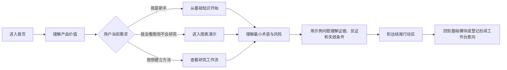

# 股市项目一级界面功能地图 v1

更新日期：2026-07-25

状态：评审稿

范围：一个公开、无需登录的一级首页；不包含任何二级详情页

## 1. 功能地图

```mermaid
flowchart TD
    A["一级首页"] --> B["全局导航"]
    A --> C["Hero 价值主张"]
    A --> D["看懂一张图"]
    A --> E["股市基础知识"]
    A --> F["研究工作流"]
    A --> G["证据与反证示例"]
    A --> H["风险与理性边界"]
    A --> I["结尾行动"]
    A --> J["页脚与来源"]

    B --> B1["首页"]
    B --> B2["基础知识锚点"]
    B --> B3["看懂图表锚点"]
    B --> B4["研究流程锚点"]
    B --> B5["风险边界锚点"]

    D --> D1["周期切换演示"]
    D --> D2["K 线四价说明"]
    D --> D3["成交量与事件标记"]
    D --> D4["预设问题与结构化回答"]

    E --> E1["市场与股票"]
    E --> E2["K 线与成交量"]
    E --> E3["公司基本面"]
    E --> E4["估值与回报"]
    E --> E5["规则与风险"]
    E --> E6["研究与复盘"]

    F --> F1["观察 Capture"]
    F --> F2["提问 Ask"]
    F --> F3["验证 Verify"]
    F --> F4["复盘 Review"]

    G --> G1["研究命题"]
    G --> G2["支持证据"]
    G --> G3["潜在反证"]
    G --> G4["失效条件"]
    G --> G5["来源与更新时间"]

    H --> H1["教育而非荐股"]
    H --> H2["AI 能力边界"]
    H --> H3["数据延迟说明"]
    H --> H4["官方规则入口"]
```

## 2. 一级用户路径

所有路径都在同一页面完成，不跳转到课程详情、个股详情、登录、定价或工作台。

## 3. 一级功能清单

| 编号 | 模块 | 用户可见功能 | 首版状态 | 数据要求 | 关键边界 |
| --- | --- | --- | --- | --- | --- |
| L1-01 | 顶部导航 | 锚点导航、当前章节提示、移动端菜单 | P0 | 无 | 不展示无可用目标的二级导航 |
| L1-02 | Hero | 品牌、价值主张、主次 CTA、可信说明 | P0 | 无 | 不承诺收益或预测准确率 |
| L1-03 | 图表演示 | 周期切换、图表说明、预设提问、结构化答案 | P0 | 授权历史数据或静态教学数据 | 不伪装实时，不允许自由荐股问答 |
| L1-04 | 基础知识 | 六张知识卡、最小术语、关键误区 | P0 | 编辑内容 | 只讲一级概念，不展开完整课程 |
| L1-05 | 研究流程 | 观察—提问—验证—复盘四步 | P0 | 示例内容 | 不把 AI 输出当作证据本身 |
| L1-06 | 命题时间线 | 支持证据、反证、失效条件、更新时间 | P0 | 可追溯示例 | 每条内容必须标注性质与来源 |
| L1-07 | 风险边界 | 投教声明、AI 边界、数据延迟、官方来源 | P0 | 官方链接 | 关键风险提示不可隐藏在弹窗里 |
| L1-08 | 结尾行动 | “从基础开始”“查看研究流程” | P0 | 无 | 首版只回到页面锚点或进入意向登记 |
| L1-09 | 页脚 | 来源、最近核对日期、版权与反馈入口 | P0 | 来源清单 | 不放无法访问的文档、社区、定价链接 |
| L1-10 | 学习进度 | 本地记录已读模块 | P1 | 浏览器本地状态 | 不要求账号 |
| L1-11 | 术语提示 | 悬停、焦点或点击显示一句解释 | P1 | 术语表 | 移动端不能依赖 hover |
| L1-12 | 内容反馈 | “这段看懂了吗”轻量反馈 | P1 | 匿名事件 | 不收集投资持仓和敏感财务信息 |

## 4. 页面锚点与导航

| 导航标签 | 锚点 | 对应内容 |
| --- | --- | --- |
| 首页 | `#top` | Hero 与产品价值 |
| 基础知识 | `#basics` | 六组一级知识 |
| 看懂图表 | `#chart` | K 线、周期、成交量与提问演示 |
| 研究流程 | `#workflow` | 观察、提问、验证、复盘 |
| 风险边界 | `#risk` | 理性投资、AI 与数据边界 |

首版右侧主操作统一为“从基础开始”，目标是 `#basics`。

参考页中的“功能、定价、社区、专栏、指南、文档、登录、打开网页版”等二级导航不进入本期。

## 5. 核心交互状态

### 5.1 图表演示

- 默认显示一份带日期的历史教学图表。
- 用户可在有限的“日线 / 周线”周期之间切换。
- 用户可选择 2–3 个预设问题，例如：
  - “这张图现在展示了哪些事实？”
  - “哪些信息仍然缺失？”
  - “什么情况会推翻当前判断？”
- 回答固定分为“已知事实 / 待验证 / 反证 / 失效条件 / 来源”。
- 不开放自由输入框，不生成“买入、卖出、目标价、仓位”指令。

### 5.2 基础知识卡

- 默认展示标题、一句话解释和 3 个关键词。
- 点击“展开要点”在当前卡片内展开，不进入新路由。
- 同一时间允许多张卡展开，用户滚动位置不能被强制重置。
- 键盘、触摸和鼠标都可操作，触控目标至少 44px。

### 5.3 命题时间线

- 明确区分“事实、解释、反证、失效条件”。
- 每条证据显示来源类型和日期。
- 颜色不是唯一的信息编码方式，必须同时使用标签和文本。

## 6. 状态与数据对象

首版只需要以下页面状态：

| 状态 | 示例 |
| --- | --- |
| 当前锚点 | `top / basics / chart / workflow / risk` |
| 图表周期 | `daily / weekly` |
| 当前预设问题 | `facts / missing / invalidation` |
| 展开的知识卡 | 本地 UI 状态 |
| 减少动态偏好 | 跟随系统设置 |
| 数据时间戳 | 示例图表日期与最近核对时间 |

明确不需要：

- 用户账户、身份认证、个人档案。
- 自选股、持仓、资金、交易记录。
- 订单、支付、订阅。
- 个性化风险测评。
- 自由文本 AI 对话历史。

## 7. 埋点建议

只记录匿名的页面行为，不收集证券账户、持仓或个人财务数据。

| 事件 | 目的 |
| --- | --- |
| `home_view` | 了解一级首页到达量 |
| `hero_cta_click` | 判断“从基础开始”的吸引力 |
| `section_reach` | 观察用户能否到达基础、流程与风险模块 |
| `basic_card_expand` | 识别最受关注的知识主题 |
| `chart_period_change` | 判断图表教学是否被使用 |
| `preset_question_select` | 判断用户最需要哪类研究帮助 |
| `risk_source_click` | 判断官方来源是否真正可发现 |
| `feedback_submit` | 收集内容是否易懂 |

## 8. 后续二级能力池

以下内容只作为未来路线图记录，不在一级界面上做可点击的假入口：

- 完整证券基础课程与测试。
- 个股、指数、行业详情。
- 实时行情、搜索、自选和提醒。
- 公司公告、财报和估值工具。
- 自由文本 AI 研究助手。
- 研究项目保存、证据库与复盘档案。
- 登录、订阅、定价、社区与专栏。
- 模拟交易或真实交易连接。
