# AI 股市分析软件一级宣传页功能地图 v2

更新日期：2026-07-25

状态：评审稿

范围：宣传 AI 股市分析软件的一级首页；不包含软件工作台内部页面

## 1. 一级页面功能地图

```mermaid
flowchart TD
    A["一级宣传首页"] --> B["全局导航"]
    A --> C["Hero 产品定位"]
    A --> D["软件实景演示"]
    A --> E["一体化工作台"]
    A --> F["研究工作流"]
    A --> G["AI 分析能力"]
    A --> H["证据与反证"]
    A --> I["使用场景"]
    A --> J["可信分析"]
    A --> K["结尾转化"]
    A --> L["页脚"]

    B --> B1["首页"]
    B --> B2["产品能力锚点"]
    B --> B3["工作流锚点"]
    B --> B4["使用场景锚点"]
    B --> B5["可信分析锚点"]
    B --> B6["打开网页版"]

    D --> D1["标的与周期"]
    D --> D2["K 线、成交与画线"]
    D --> D3["AI 图表上下文"]
    D --> D4["分析问题"]
    D --> D5["结构化判断"]

    F --> F1["捕捉线索 Capture"]
    F --> F2["提出问题 Ask"]
    F --> F3["验证假设 Verify"]
    F --> F4["跟踪复盘 Review"]

    G --> G1["读懂当前图表"]
    G --> G2["连接市场上下文"]
    G --> G3["汇总基本面与事件"]
    G --> G4["形成结构化判断"]
    G --> G5["定义失效条件"]
    G --> G6["持续研究与复盘"]

    H --> H1["研究命题"]
    H --> H2["支持证据"]
    H --> H3["潜在反证"]
    H --> H4["待验证项"]
    H --> H5["失效条件"]
    H --> H6["来源与更新时间"]

    I --> I1["个股看盘"]
    I --> I2["事件验证"]
    I --> I3["财报跟踪"]
    I --> I4["行业研究"]

    J --> J1["事实与推断分层"]
    J --> J2["数据来源与延迟"]
    J --> J3["AI 不确定性"]
    J --> J4["非自动交易"]
```

## 2. 一级转化路径

一级页面的主要任务是把用户送到软件，不承担投教课程、个股详情或完整分析任务。

## 3. 一级功能清单

| 编号 | 模块 | 用户可见功能 | 首版状态 | 数据要求 | 关键边界 |
| --- | --- | --- | --- | --- | --- |
| L1-01 | 顶部导航 | 页内锚点、登录、打开网页版 | P0 | 产品路由 | 不设计目标二级页 |
| L1-02 | Hero | 产品定位、双 CTA、可信说明 | P0 | 无 | 不使用课程或荐股表达 |
| L1-03 | 软件实景 | 图表、标的、周期、自选、AI 面板 | P0 | 真实或高保真产品数据 | 软件必须比装饰背景更突出 |
| L1-04 | 图表问题演示 | 切换 2–3 个预设分析问题 | P0 | 审核后的分析样例 | 不输出确定性买卖指令 |
| L1-05 | 结构化分析 | 支持证据、反证、关键位、失效条件 | P0 | 带来源和时间的数据 | 事实与推断分层 |
| L1-06 | 一体化工作台 | 展示图表、AI、行情、公告、财务、复盘连接 | P0 | 产品能力文案 | 不伪造尚不存在的连接能力 |
| L1-07 | 研究工作流 | 捕捉、提问、验证、复盘 | P0 | 场景示例 | 不拆成步骤页 |
| L1-08 | 核心能力 | 六组 AI 分析能力 | P0 | 产品能力清单 | 不变成股市基础知识卡 |
| L1-09 | 命题时间线 | 证据、反证、待验证、失效条件 | P0 | 可追溯研究示例 | 每条内容带性质、来源和日期 |
| L1-10 | 使用场景 | 个股、事件、财报、行业场景切换 | P0 | 审核后的案例 | 场景不等于荐股 |
| L1-11 | 可信分析 | 来源、延迟、不确定性、非自动交易 | P0 | 数据与合规说明 | 不能只放页脚小字 |
| L1-12 | 结尾转化 | 打开网页版、了解专业版或下载桌面端 | P0/P1 | 真实产品状态 | 不展示不可用 CTA |
| L1-13 | 页脚 | 产品、资源、法律与风险提示 | P0 | 真实链接 | 不创建空页面 |

## 4. 页面锚点与导航

| 导航标签 | 锚点或目标 | 对应内容 |
| --- | --- | --- |
| 首页 | `#top` | Hero 与产品定位 |
| 产品能力 | `#capabilities` | 一体化工作台与六组能力 |
| 工作流 | `#workflow` | 捕捉、提问、验证、复盘 |
| 使用场景 | `#scenarios` | 个股、事件、财报、行业 |
| 可信分析 | `#trust` | 来源、时间、不确定性与边界 |
| 打开网页版 | 未来工作台路由 | 主要转化目标 |

“定价、社区、专栏、指南、文档”可以保留在长期导航规划中，本期不设计对应页面，也不能提供失效链接。

## 5. 软件实景演示状态

### 5.1 默认状态

- 展示一个真实或明确标注日期的历史标的。
- 默认周期为日线。
- 图表包含 K 线、成交量、用户画线和事件标记。
- AI 面板显示“已连接当前图表上下文”。
- 默认问题聚焦结构判断，不直接询问买卖。

### 5.2 预设问题

- “这次突破有哪些证据支持？”
- “当前判断最大的反证是什么？”
- “什么价位或事件会使这个判断失效？”

### 5.3 输出结构

- 当前结构。
- 支持证据。
- 潜在反证。
- 关键位置。
- 失效条件。
- 待验证项。
- 来源与更新时间。

一级页只需要演示这些状态，不复刻工作台的全部工具栏和操作。

## 6. 使用场景状态

| 场景 | 实景变化 | AI 重点 |
| --- | --- | --- |
| 个股看盘 | 图表结构与成交变化 | 趋势、结构、关键位、反证 |
| 事件验证 | 公告或新闻事件进入时间线 | 原始来源、影响路径、待验证项 |
| 财报跟踪 | 财务数据与预期对照 | 收入、利润、现金流、指引和价格反应 |
| 行业研究 | 行业指数、成分和上下游 | 相对强弱、扩散范围、催化与失效条件 |

切换场景时保持同一软件框架，只改变内容上下文，不制作四套页面。

## 7. 页面状态与数据对象

| 状态 | 示例 |
| --- | --- |
| 当前锚点 | `top / capabilities / workflow / scenarios / trust` |
| 当前演示问题 | `support / counter / invalidation` |
| 当前使用场景 | `stock / event / earnings / sector` |
| 当前图表周期 | `daily / weekly` |
| 当前分析状态 | `context-connected / analyzing / complete` |
| 数据状态 | `live / delayed / historical` |
| 来源状态 | `verified / pending` |
| 减少动态偏好 | 跟随系统设置 |

## 8. 转化与分析事件

| 事件 | 目的 |
| --- | --- |
| `landing_view` | 了解宣传页到达量 |
| `hero_primary_cta_click` | 衡量首屏到网页版的转化 |
| `hero_workflow_click` | 衡量用户对工作原理的兴趣 |
| `product_demo_question_select` | 识别最有吸引力的分析问题 |
| `capability_focus` | 识别最受关注的产品能力 |
| `workflow_step_focus` | 判断用户是否理解研究闭环 |
| `scenario_select` | 识别核心使用需求 |
| `source_open` | 衡量用户对分析来源的关注 |
| `final_cta_click` | 衡量完整阅读后的转化 |
| `workspace_first_analysis_complete` | 衡量宣传到真实价值的最终转化 |

不收集用户持仓、证券账户、资金或未授权的研究内容作为营销埋点。

## 9. 不在一级宣传页实现

- 股市基础知识课程、术语教学和学习进度。
- 工作台内部的完整图表操作。
- 个股、指数、行业详情页。
- 完整 AI 自由对话。
- 自选股、提醒、研究项目和复盘档案的真实业务逻辑。
- 登录、支付、订阅、定价、社区、专栏、指南和文档页面。
- 券商连接、模拟交易、自动交易或实盘下单。

这些能力可以在宣传页被真实、克制地介绍，但不能伪装成已经可用的交互。
